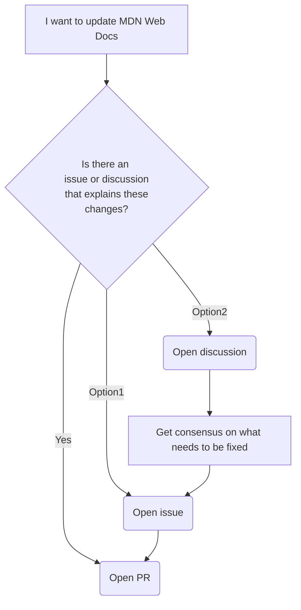

# Pull request submission workflows

## Workflow for pull request author

```mermaid
graph TD
    A[I want to update MDN Web Docs]-->B{Is there an <br> issue or discussion <br> that explains these changes?}
    B -->|Yes| C(Open PR)
    B -->|Option1| D(Open issue)
    B -->|Option2| E(Open discussion) --> F[Get consensus on what needs to be fixed] --> D
    D --> C
```

## Workflow for pull request reviewer
