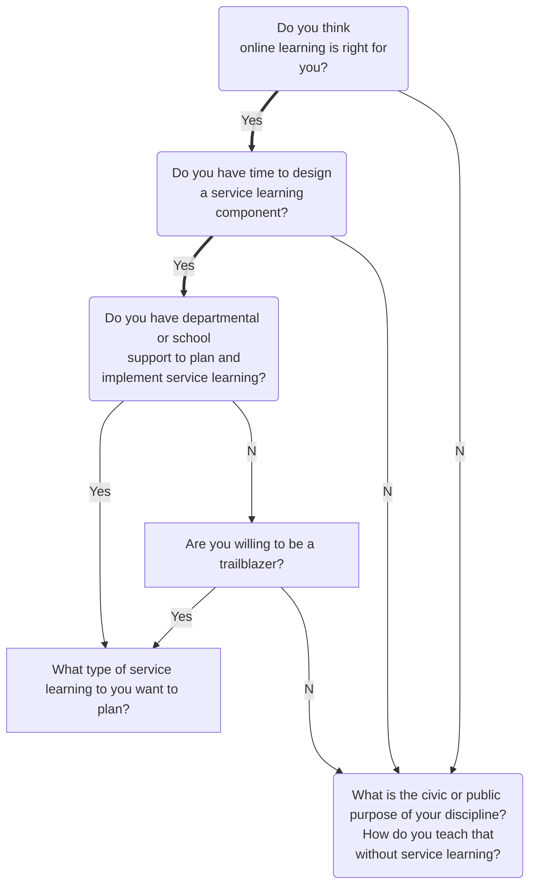

# Pull Request submission and review guidelines

## Purpose of this document

The objective of this document is to have a single place with information from the following pages:

- **PR etiquette:** https://github.com/mdn/content#pull-request-etiquette
- **Reviewing PRs:** https://github.com/mdn/content/blob/main/REVIEWING.md
- **Open source etiquette:** https://developer.mozilla.org/en-US/docs/MDN/Contribute/Open_source_etiquette

## Contributing to MDN

This section describes how contributors make changes on MDN Web Docs and how the changes are reviewed and land on the site.
Content changes to MDN Web Docs are related to a variety of work streams, including:

- **Day-to-day content improvements:** documentation of new APIs, CSS properties, platform updates and content additions.
  This is usually done by MDN Web Docs staff working for Mozilla, Google, Open Web Docs, Samsung, but also by community volunteers.
- **Minor fixes:** small updates done to the site to fix typos, grammatical issues, and technical inaccuracies.
  These issues are usually found by users of MDN Web Docs.
- **Content bug fixes:** usually done by volunteers to close issues on `mdn/content` repo.

Regardless of how content changes are done, they are submitted as pull requests (PRs) on GitHub:

1. **Reviewers** comprised of MDN staff members and volunteers are "topic review owners".
   When a pull request related to a particular topic is opened, it will be assigned to that area's topic review owners.
   The `CODEOWNERS` file specifies the teams who own certain content directories.
2. **Approved pull requests** can be merged after a approving review has been made.
   The assigned reviewer will merge the pull request.
3. **Content update** is done automatically via a site rebuild once every 24 hours.
   Volunteers can see their changes go live within a day of merging.

### Decision tree

TODO: example decision tree in mermaid

### Before you open a pull request

Anyone who plans to open a PR to make a change on MDN Web Docs should:

- **Open a discussion** to describe why you think the changes are required to improve the content.
  This is important if your PR is a technical change, not typo fixes, grammatical improvements, formatting or structural changes.
- **File an issue describing what the PR will change.**
  When you submit a PR, reference this issue using `#` followed by the issue's ID, for example `#1234`.

### Making a pull request

- **PRs should be short and focused to one issue** or a related set of changes.
  If a PR becomes too large, the reviewer may close your PR and ask that you submit a separate PR for each logical set of changes that belong together.
- **PRs should not contain large amounts of grammar updates**.
  MDN Web Docs contains technical documentation; you should not report improvements in the grammar, but cases where the grammar is incorrect are acceptable.
- **PRs that update API usage need an accompanying mdn/content PR** to update the corresponding documentation.
  PRs of this type may be rejected if there is no corresponding content PR.
- **Don't enable auto-merge.**
- **Add 'depends on'** if there are PRs that must land first (e.g. linked examples in other repos)

### After you open a pull request

- **Handle CI failures** from the automated tests run as GitHub Actions (see `.github/workflows`).
  If one or more of these tests fail, it is your responsibility to try and resolve them.
  Your PR will not be approved and merged if these tests are failing.
  If you don't know how to resolve the underlying issues, ask for help.

- **Resolve merge conflicts** with the main branch; you are responsible for resolving these.
  You can do this by merging the main branch into your branch (`git pull mdn main`), and pushing the updated branch to your fork (git push).

- **Don't reopen closed PRs.** If you must create a new PR, it can reference the closed one.

## Guidelines for reviewing a pull request

A person is automatically assigned to review open PRs.
If the author has someone specific in mind that they would like to review their work (e.g. you are working within a team) the author should assign/unassign relevant reviewers themselves.

- Reviewers should check they are assigned. If they want to review and are not assigned they should add themselves as an assignee. It's polite to check with the original assignee but not required.
- Working in teams: Authors should mention their team members they want to review when opening the PR and assign them.
- Reviewers that are automatically assigned should check the PR notes to make sure no one specific is assigned.

- Committing changes to another PR: If a PR is fine apart from a small typo or some other minor issue, you might want to just fix the issue yourself rather than ask the PR author to change it. You can do this provided the PR has been set up to allow changes (see Allowing changes to a pull request branch created from a fork on GitHub for more details).
  - If you are not sure how to make changes to someone else's PR, @vkWeb wrote some nice simple instructions on how to do this from the command line; see ReviewPRCommands.
  - Alternatively, you can edit files using the GitHub UI — go to the pull request's "Files changed" tab, find the file you want to edit, and choose "three dot" menu (...) > Edit file.
- Merging PRs: The assigned PR reviewer merges the PR. This can also be the reviewer you asked for help with the review.
- Resolving merge conflicts: You may encounter merge conflicts as you review PRs if another PR that touches some of the same files got merged before the one you are reviewing. Addressing merge conflicts on GitHub is a useful resource to help you. Feel free also to ask your team(s) for help if you need it.

### If you are assigned to review a PR

- **Code examples should follow guidelines.**
- **Check the MDN Writing style guide**, and use it to inform your review new content.
- **Use GitHub's review tools:**
  - "Request changes" when submitting a review that will require the PR author to do some more work
  - "Suggest changes" if you have a concrete suggestion for the author
  - "Approve" if the submission is ready and you want to merge it.
- **Follow code of conduct:** Be polite and constructive when writing review comments, interacting with the PR author or other community members. We are all bound by our Code of Conduct when contributing to MDN Web Docs, which means adhering to Mozilla's Community Participation Guidelines. If anyone has engaged in behavior that is potentially illegal or makes you or someone else feel unsafe, unwelcome, or uncomfortable, you are encouraged to report it. We want MDN Web Docs to be a welcoming, friendly community that we can all be proud of.
- **Limit the scope of review:** If the changes match the PR description, you should merge it, even if there are other improvements that could be made in the same file. If you want to ensure that these other improvements will be taken care of, file a follow-up issue or a PR of your own to address these improvements/issues.

### Reviewing a pull request

- **Add a comment** to let the author know you are aware of the PR and will start the review.
  This to avoid someone else reviewing the PR at the same time as you and so that others know it's on your radar for review.
- **Ask for information from the PR author** to help with your review if the PR author has not explained why they are making this change. Ideally, reference an issue that is addressed in the PR.
- **Close PRs with unrelated changes** if it is too complex and/or contains multiple unrelated changes.
  You may ask the PR author to submit their changes in smaller chunks.
- **Ask for load balancing help** if your plate is full at the moment and you don't think you will be able to complete the review even in the next one week or so. Copy the team (`@core-yari-content`) and ask if someone else can take up the review.
- **Ask for help** if you're open to receiving or want technical help with the review, and add the `review-help-needed` label.
- **Don't merge unless 'depends on'** PRs are merged first.

#### What to do if you are stuck

If you don't understand a content change that you've been selected to review or feel that it is too large and complex for you to deal with, don't panic!
Reach out to someone like a colleague or topic owner and ask for assistance.
If you are not sure who to ask for help, get in touch with the `@core-yari-content` group.

It is rare that you'll be required to review a large, complex content change with no warning, like a complete page rewrite, or the addition of several new reference pages or tutorials.
Usually such changes are done as part of specific work streams where the content has been approved for addition and reviewer(s) have been assigned already.
In such cases, the PR should be linked to an issue that explains all these details.
If you are not sure, ask the PR author if they need a review of the content, and where the rationale behind the change is explained.
Ping our team on MDN Web Docs chat room to ask for help if you are still not sure or if you think the content is suspicious.

## Timelines

This section provides details for expected turnaround times while reviewing PRs if you're a reviewer and while responding to review comments if you're a PR author.

- PR review: The assigned reviewer should be able to review the PR in 2 weeks or less. In the 2 weeks after the PR is open, the assigned reviewer can:
  - Leave a comment about when they can start reviewing the PR
  - Ask for technical or resource help
- Fixes for review comments: The PR author should be able to respond to or fix the comments in 4 weeks or less.
  If the PR author is unable to respond or fix the review comments in that time, the reviewer can do one of the following:
  - Commit the changes and merge the PR
  - Close the PR

## Topic owners

Some of PRs submitted on the mdn/content repo relate to specific work streams being undertaken by browser vendors or other organizations that have a defined set of writers and reviewers. In these cases, the PR author of the PR will include the username of the reviewer in a line at the bottom of the pull request description, for example:

reviewer: @jpmedley
Upon submitting the PR, they will request a review from the reviewer specified in the PR description. Once that reviewer has approved the new content, they will then ask you for an approval as required by the CODEOWNERS system for the pull request to be mergeable.
Therefore, if you receive a PR review request and then see that you have been overridden with another reviewer in the manner described above, then don't review the changes — just wait for an approval request.
Guidelines for reviewing a pull request
These guidelines apply to anyone who is tasked with reviewing MDN Web Docs content PRs.
Prerequisite knowledge and Github tools

The following specific topic areas are being reviewed by the kind souls listed underneath them. Be kind to them, and thank them for all the help they give to this project. If you would like to help with MDN content reviews, get in touch with us.
Note that changes to any content areas not explicitly listed below will be handled by the @core-yari-content team, which currently consists of @Rumyra.

- Web accessibility content:
  - @ericwbailey
- General learning content:
  - @chrisdavidmills
- CSS learning content:
  - @rachelandrew
- Server-side learning content:
  - @hamishwillee
- MDN meta docs — the @yari-content-mdn team, which consists of:
  - @Rumyra
  - @Elchi3
- Firefox Developer Tools content:
  - @hamishwillee
- Mozilla Add-ons reference content — the @yari-content-mozilla-add-ons team, which consists of:
  - @caitmuenster
  - @rpl
  - @Rob--W
  - @zombie
  - @mixedpuppy
- HTTP reference content — the @yari-content-http team, which consists of:
  - @hamishwillee
  - @Elchi3
  - @mirunacurtean
- CSS reference content — the @yari-content-css team, which consists of:
  - @rachelandrew
  - @ericwbailey
  - @mirunacurtean
- HTML reference content — the @yari-content-html team, which consists of:
  - @rachelandrew
  - @ericwbailey
  - @mirunacurtean
- JavaScript reference content — the @yari-content-javascript team, which consists of:
  - @Rumyra
  - @sideshowbarker
  - @Elchi3
- Web API reference content — the @yari-content-web-api team, which consists of:
  - @Rumyra
  - @sideshowbarker
  - @Elchi3
  - @jpmedley
- SVG reference content — the @yari-content-svg team, which consists of:
  - @Ryuno-Ki
    Reviewer alumni
    The following folks used to be in one or more of our review teams, but no longer have the time to contribute; we want to give them our sincere thanks for all their help.
- @vkWeb
